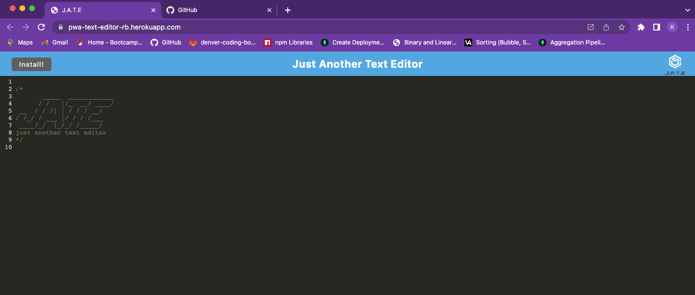

# 📝 Progressive Web Applications (PWA): Text Editor
[](https://opensource.org/licenses/MIT)

## [Heroku Deployment Link](https://pwa-text-editor-rb.herokuapp.com/)

## Overview

```md
This repository contains code for a basic IDE text editor that was created as a means of 
practicing the Progessive Web App (PWA) library Webpack.  This Text Editor can be used 
for note taking or coding alike, and all entries are saved automatically.
```

## Table Of Contents
- [Acceptance Criteria](#acceptance-criteria)
- [Static Screenshots](#static-screenshots)
- [Installation](#installation)
- [Challenges](#challenges)
- [Future Developement](#future-development)
- [Contributing](#contributing)
- [Technology Used](#technology-used)
- [Contact Info](#contact-info)

## Acceptance Criteria

```md
GIVEN a text editor web application
WHEN I open my application in my editor
THEN I should see a client server folder structure
WHEN I run `npm run start` from the root directory
THEN I find that my application should start up the backend and serve the client
WHEN I run the text editor application from my terminal
THEN I find that my JavaScript files have been bundled using webpack
WHEN I run my webpack plugins
THEN I find that I have a generated HTML file, service worker, and a manifest file
WHEN I use next-gen JavaScript in my application
THEN I find that the text editor still functions in the browser without errors
WHEN I open the text editor
THEN I find that IndexedDB has immediately created a database storage
WHEN I enter content and subsequently click off of the DOM window
THEN I find that the content in the text editor has been saved with IndexedDB
WHEN I reopen the text editor after closing it
THEN I find that the content in the text editor has been retrieved from our IndexedDB
WHEN I click on the Install button
THEN I download my web application as an icon on my desktop
WHEN I load my web application
THEN I should have a registered service worker using workbox
WHEN I register a service worker
THEN I should have my static assets pre cached upon loading along with subsequent pages and static assets
WHEN I deploy to Heroku
THEN I should have proper build scripts for a webpack application
```
## Static Screenshots



## Installation
(A) 
1. Clone this repo to your local machine.  
2. Run ```npm install``` in your terminal to download all necessary packages.
3. Run ``` npm start ``` in your terminal to start the program.
4. Open your browser and navigate to ```http://localhost:3000``` to use the app on your machine.

(B)

Alternatively, this app has been deployed to Heroku so it can be used through your URL. Click ```install``` at the top left-hand corner of your screen to download the app to your Desktop.

## Challenges
As this was a refactoring project, there were only a few challenges along the way. The first was getting the Service Worker registered properly in the ```src-sw.js``` file.  Secondly, the installation proved to be tricky during development because it took a little while to figure out how to ```uninstall``` it to continue development.  

## Future Development
In the future, I would like to create a Text Editor from scratch that could be useful as an alternative to VS Code (not that one is necessary).

## Contributing
[](code_of_conduct.md)

As this was refactored for a University of Denver coding bootcamp assignment, public contributing is discouraged.

## Technology Used
- [node.js](https://nodejs.org/en/)
- [indexedDB API](https://developer.mozilla.org/en-US/docs/Web/API/IndexedDB_API): for client-side, browser database usable offline.
- [Webpack](https://webpack.js.org/): for client-side bundling and service workers
- [concurrently](https://www.npmjs.com/package/concurrently): a development tool for initializing multiple packages at the same time
- [nodemon](https://www.npmjs.com/package/nodemon): development package for real time server updates
- [express.js](https://www.npmjs.com/package/express): npm package for routing and server
- [babel](https://babeljs.io/): a JavaScript compiler for JS versions before ES6
- [idb](): npm wrapper for indexedDB

## Contact Info
- Email Rod: rod.bennett75@gmail.com
- [Rod's Github Profile](https://github.com/RodBennett)
